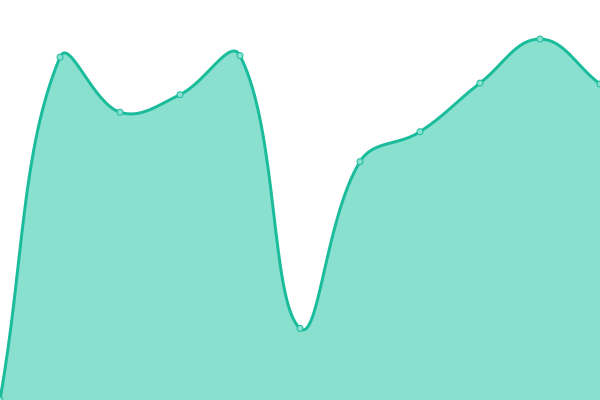

# [📈 Live Status](https://TE-Group.github.io/Upptime): <!--live status--> **🟩 All systems operational**

This repository contains the open-source uptime monitor and status page for [Travel Expert Group](https://TE-Group.github.io/Upptime), powered by [Upptime](https://github.com/upptime/upptime).

With [Upptime](https://upptime.js.org), you can get your own unlimited and free uptime monitor and status page, powered entirely by a GitHub repository. We use [Issues](https://github.com/TE-Group/Upptime/issues) as incident reports, [Actions](https://github.com/TE-Group/Upptime/actions) as uptime monitors, and [Pages](https://TE-Group.github.io/Upptime) for the status page.

<!--start: status pages-->
<!-- This summary is generated by Upptime (https://github.com/upptime/upptime) -->
<!-- Do not edit this manually, your changes will be overwritten -->
<!-- prettier-ignore -->
| URL | Status | History | Response Time | Uptime |
| --- | ------ | ------- | ------------- | ------ |
|  [TE-Texpert.com](https://www.texpert.com/) | 🟩 Up | [te-texpert-com.yml](https://github.com/TE-Group/Upptime/commits/HEAD/history/te-texpert-com.yml) | 

 1829ms
     
 | 

<a href="https://TE-Group.github.io/Upptime/history/te-texpert-com">98.95%</a>
    

|  [TE-PHL](https://www.premiumholidays.com/) | 🟩 Up | [te-phl.yml](https://github.com/TE-Group/Upptime/commits/HEAD/history/te-phl.yml) | 

 3642ms
     
 | 

<a href="https://TE-Group.github.io/Upptime/history/te-phl">99.34%</a>
    

|  [TE-PromoSite](https://go.texpert.com/zh) | 🟩 Up | [te-promo-site.yml](https://github.com/TE-Group/Upptime/commits/HEAD/history/te-promo-site.yml) | 

 2001ms
     
 | 

<a href="https://TE-Group.github.io/Upptime/history/te-promo-site">99.36%</a>
    

|  [TE-Library](https://teslib.com/te-library/ping) | 🟩 Up | [te-library.yml](https://github.com/TE-Group/Upptime/commits/HEAD/history/te-library.yml) | 

 2633ms
     
 | 

<a href="https://TE-Group.github.io/Upptime/history/te-library">99.37%</a>
    

|  [TE-Normalizer-Library](https://teslib.com/normalizer-library/help) | 🟩 Up | [te-normalizer-library.yml](https://github.com/TE-Group/Upptime/commits/HEAD/history/te-normalizer-library.yml) | 

 2352ms
     
 | 

<a href="https://TE-Group.github.io/Upptime/history/te-normalizer-library">99.38%</a>
    

|  [TE-Texpert-Staging](https://stage.teslib.com/te-library/ping) | 🟩 Up | [te-texpert-staging.yml](https://github.com/TE-Group/Upptime/commits/HEAD/history/te-texpert-staging.yml) | 

 2571ms
     
 | 

<a href="https://TE-Group.github.io/Upptime/history/te-texpert-staging">99.38%</a>
    

|  [Merchant-Backend-API](https://merchant-api.texpert.com) | 🟩 Up | [merchant-backend-api.yml](https://github.com/TE-Group/Upptime/commits/HEAD/history/merchant-backend-api.yml) | 

 1502ms
     
 | 

<a href="https://TE-Group.github.io/Upptime/history/merchant-backend-api">99.40%</a>
    

|  [Hotel-Backoffice-Admin](https://backoffice.texpert.com) | 🟩 Up | [hotel-backoffice-admin.yml](https://github.com/TE-Group/Upptime/commits/HEAD/history/hotel-backoffice-admin.yml) | 

 760ms
     
 | 

<a href="https://TE-Group.github.io/Upptime/history/hotel-backoffice-admin">100.00%</a>
    

|  [V2 TE-Texpert.com](https://v2.texpert.com) | 🟩 Up | [v2-te-texpert-com.yml](https://github.com/TE-Group/Upptime/commits/HEAD/history/v2-te-texpert-com.yml) | 

 2378ms
     
 | 

<a href="https://TE-Group.github.io/Upptime/history/v2-te-texpert-com">99.41%</a>
    

<!--end: status pages-->

[**Visit our status website →**](https://TE-Group.github.io/Upptime)

## 📄 License

- Powered by: [Upptime](https://github.com/upptime/upptime)
- Code: [MIT](./LICENSE) © [Travel Expert Group](https://TE-Group.github.io/Upptime)
- Data in the `./history` directory: [Open Database License](https://opendatacommons.org/licenses/odbl/1-0/)
